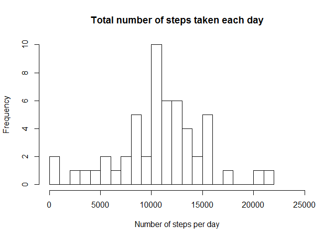
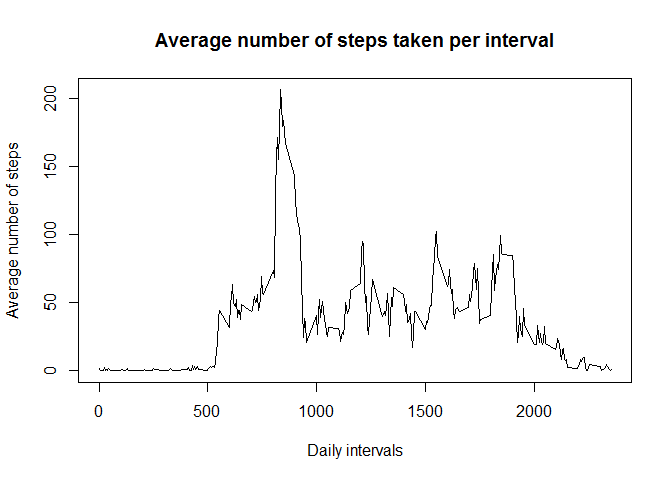
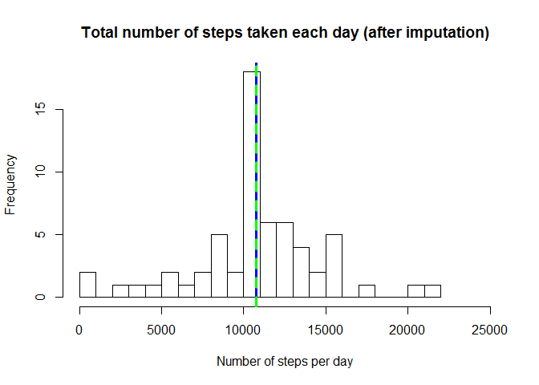

# Reproducible Research: Peer Assessment 1


## Loading and preprocessing the data (1)


```r
# Unzipping the file
unzip("activity.zip")
```

```r
# Reading in the CSV file
library(data.table)
data<-fread("activity.csv",sep = ",", header=TRUE,na.strings = "NA")
```

```r
# Transform date column to date type
data$date<-as.Date(data$date,format = "%Y-%m-%d")
```


## What is mean total number of steps taken per day?


```r
# Loading dplyr package
library(dplyr)
```


```r
# Total number of steps taken per day
data_day<-data %>% group_by(date) %>% summarise(totalSteps=sum(steps))

# Histogram of the total number of steps taken each day (2)
hist(data_day$totalSteps, breaks=20, main="Total number of steps taken each day", xlab="Number of steps per day", xlim=c(0,25000))
```

 

```r
    # Mean total number of steps per day
mean(data_day$totalSteps, na.rm = T)
```

```
## [1] 10766.19
```

```r
# Median number of steps taken each day
median(data_day$totalSteps, na.rm=T)
```

```
## [1] 10765
```

## What is the average daily activity pattern?


```r
# Time series plot of the average number of steps taken
    # Generate data
    data_int <- data %>% group_by(interval) %>% summarise(avgSteps=mean(steps, na.rm=T))
    # Make the plot
    plot(x = data_int$interval, y=data_int$avgSteps, type="l",main= "Average number of steps taken per interval", xlab="Daily intervals", ylab = "Average number of steps")
```

 

```r
# Which 5-minute interval, on average across all the days in the dataset, contains the maximum number of steps?
data_int$interval[which.max(data_int$avgSteps)]
```

```
## [1] 835
```


## Imputing missing values


```r
    # Total number of missing values in the dataset
    sum(is.na(data))
```

```
## [1] 2304
```

```r
    # Filling NA's with the 5-min interval mean
        #Calculate interval means
        data_int2 <- data %>% group_by(interval) %>% summarise(meanSteps=mean(steps, na.rm=T))
        #Filling the initial dataset NAs
            #Merge the datasets
            data2<-merge(data,data_int2,by = c("interval"))
            #Replace NAs
            data2$steps[is.na(data2$steps)]<-data2$meanSteps[is.na(data2$steps)]
        #New dataset (additional column is removed)
            data2<-data2[,!c("meanSteps"), with=FALSE]
```

```r
# Histogram of the total number of steps taken each day
    #Calculate data
    data2_day <- data2 %>% group_by(date) %>% summarise(totalSteps=sum(steps))
        #Mean number of steps
    mean<-mean(data2_day$totalSteps, na.rm=T)
    mean
```

```
## [1] 10766.19
```

```r
    #Median number of steps
    median <- median(data2_day$totalSteps, na.rm=T)
    median
```

```
## [1] 10766.19
```

```r
    #Make the histogram
    hist(data2_day$totalSteps, breaks=20, main="Total number of steps taken each day (after imputation)", xlab="Number of steps per day", xlim=c(0,25000))
        #adding mean (blue) and median (green) to the plot
        abline(v = mean, lwd=3, col="blue")
        abline(v = median, lwd=3, lty=2, col="green")
```

 

## Are there differences in activity patterns between weekdays and weekends?


